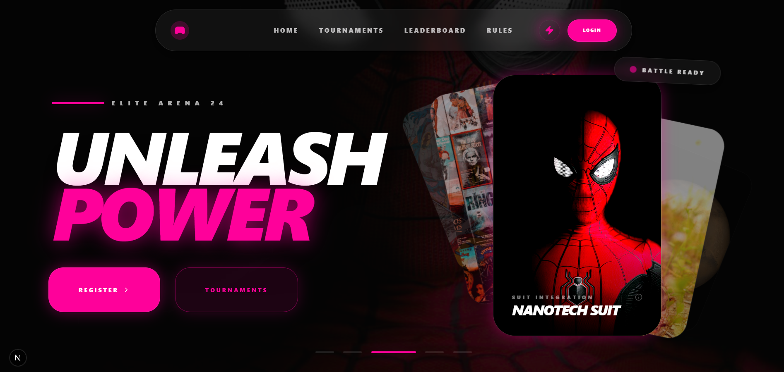
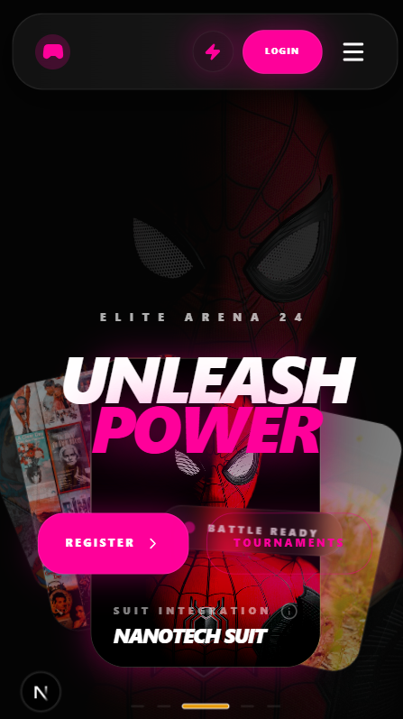
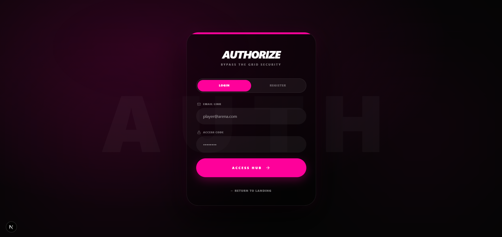
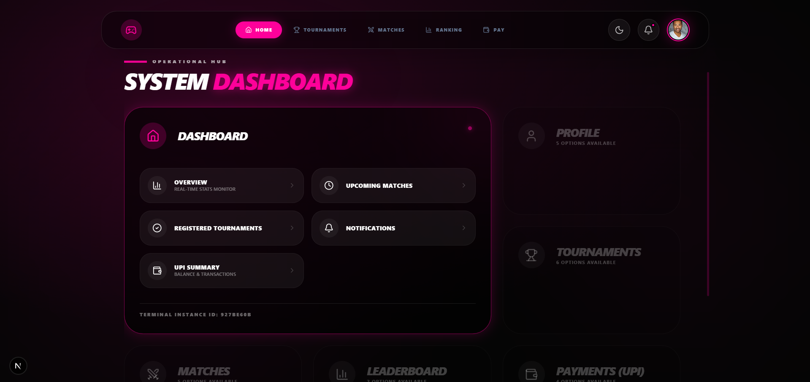

# ARENA UI: Cinematic Tournament Frontend

A pure frontend UI showcase built with Next.js App Router and Tailwind CSS.

This project focuses on visual design, motion, and layout systems for a premium tournament experience. It includes themed landing/auth/dashboard/admin screens with no backend dependency.

## Highlights

- Cinematic landing page with animated hero, gallery stack, and section storytelling.
- Dual visual modes:
  - `miles`: dark neon mood
  - `peter`: light high-contrast mood
- Reusable glassmorphic UI style and glow utilities.
- Auth, dashboard, and admin pages implemented as UI-only flows.
- Fully static frontend behavior suitable for portfolio/demo usage.

## Tech Stack

- Next.js 16 (App Router)
- React 19
- TypeScript
- Tailwind CSS v4
- Lucide React

## Project Structure

- `src/app` - route pages and layouts
- `src/components/layout` - navbar, wrappers, dashboard/admin shells, auth form
- `src/components/ui` - reusable UI primitives
- `src/context/ThemeContext.tsx` - global theme toggle (`miles` / `peter`)
- `src/app/globals.css` - design tokens, theme variables, utility styles

## Screenshots

### Landing Page



### Landing Page (Responsive)



### Login Page



### Dashboard



## Run Locally

1. Install dependencies:

```bash
npm install
```

2. Start development server:

```bash
npm run dev
```

3. Open:

```text
http://localhost:3000
```

Useful direct routes:

- `http://localhost:3000/login`
- `http://localhost:3000/register`
- `http://localhost:3000/dashboard`
- `http://localhost:3000/admin`

## Available Scripts

- `npm run dev` - start local dev server
- `npm run build` - production build
- `npm run start` - run production build
- `npm run lint` - run ESLint

## Notes

- This repository is frontend-only (UI showcase).
- No database/auth backend is required to run the project.

## Project Status

- This design system is currently under active development.
- Some admin dashboard modules are still incomplete and need implementation.
- Some theme states and UI details are not fully polished yet and may look inconsistent in certain screens.

## Free Use and Editing

- You can use, edit, and customize this project freely for personal or commercial work.
- You are encouraged to modify pages, components, and theme styles to match your own product needs.
- Usage is provided under the MIT License (see License section below).

## Fork and Build Your Version

You can fork this repository and continue development on your own version:

1. Click `Fork` on GitHub.
2. Clone your fork locally.
3. Run `npm install` and `npm run dev`.
4. Start improving incomplete modules, especially in admin/dashboard flows.
5. Refine theme/UI consistency across all pages.

If you improve missing modules or fix theme inconsistencies, feel free to open a pull request.

## License

MIT

